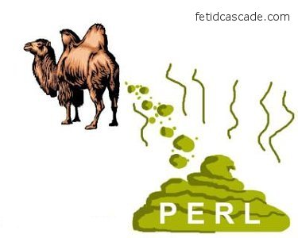
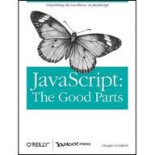
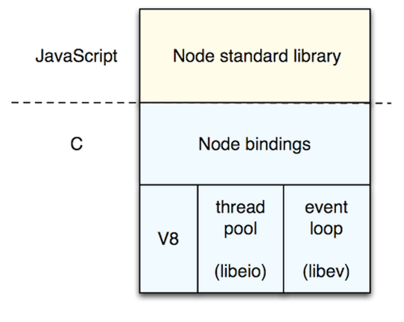
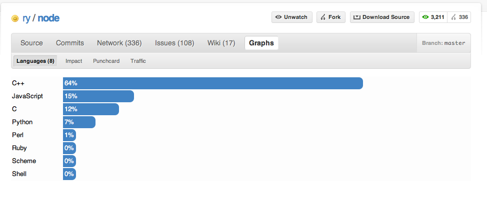
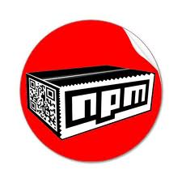

!SLIDE
# Node.js in Perspective
### hopefully

## Dylan Clendenin

!SLIDE
# but first,
## a superficial departure on the subject of
# me

!SLIDE
# but first,
## a superficial departure on the subject of
# meh

!SLIDE center
## [@deepthawtz](http://twitter.com/deepthawtz)
### you know what this is

!SLIDE
## you might not know

!SLIDE center
# I play bass

!SLIDE center
# I draw gorillas

!SLIDE center

!SLIDE
# I make web apps mostly

!SLIDE
# github.com/**deepthawtz**

!SLIDE
# a brief overview

!SLIDE center
# Learned basics of programming in Perl

!SLIDE center
# I continued to amuse myself

!SLIDE center
# I thought I arrived in Rubyland

!SLIDE center
# ...but also took a year to exclusively use Python

!SLIDE
# and JavaScript?

!SLIDE center
# JavaScript is the only one who has had my back

!SLIDE center
# Highly Recommended
## It is short!

!SLIDE center

!SLIDE center

!SLIDE center

!SLIDE code

    @@@ javascript
    var shizzle = SnoopDogg.holla("Excuse me...");

    MyNizzle.fo(shizzle);

!SLIDE
    @@@ javascript
    var shizzle = SnoopDogg.holla("Excuse me...");
    
    // ...waiting
    MyNizzle.fo(shizzle);

!SLIDE center

!SLIDE code

    @@@ javascript
    SnoopDogg.holla("Excuse me...", function(shizzle) {
      MyNizzle.fo(shizzle);
    });

    // move on
    doBigThangs();

!SLIDE commandline
# Installing

    $ git clone git://github.com/ry/node.git
    $ cd node
    $ ./configure
    $ make
    $ make install

!SLIDE commandline
# Run the node shell

    $ node
    Type '.help' for options.
    node>

!SLIDE
# Overview and Highlights

!SLIDE bullets small
# Meet the Globals

* global
* process
* require()
* require.paths
* __filename
* __dirname
* module

!SLIDE
# Simple module system

!SLIDE code

    @@@ javascript
    // yo.js
    exports.yo = function() {
      return "yo";
    }

    // main.js
    var yo = require("./yo.js");
    console.log(yo);

!SLIDE
# File system
## wrappers around standard POSIX functions

!SLIDE code small

    @@@ javascript
    var fs = require("fs");

    fs.readFile("/etc/password", function(err, data) {
      if (err) throw err;
      // munge
    });

!SLIDE
# process global object

!SLIDE code small
    @@@ javascript
    var stdin = process.openStdin();

    // never say die
    process.on("SIGINT", function() {
      console.log("na na na na na na");
    })

!SLIDE code small
# commandline args

    @@@ javascript
    process.argv.forEach(function(val, index, array) {
      console.log(index + ": " + val);
    });

!SLIDE
# Spawn child processes

!SLIDE code small

    @@@ javascript
    // spawn child process
    var spawn = require("child_process").spawn
       , sh   = spawn("sh", ["-c","cal; sleep 2; echo ok"])
       , sys  = require("sys")
       ;

    // event listener
    sh.stdout.on("data", function(data) {
      sys.print(data);
    });

!SLIDE
# EventEmitter
## all objects which emit events are instances of events.EventEmitter

!SLIDE
# How familiar is this?
    @@@ javascript
    $(".balloon").click(function() {
      this.pop();
    });

!SLIDE center
# HTTP
    @@@ javascript
    var http = require("http");

!SLIDE code small
    @@@ javascript
    var http = require("http");
    var google = http.creatClient(80, "google.com");
    var request = google.request("GET", "/",
      {"host":"google.com"});
    request.end();

    request.on("response", function(response) {
      console.log("STATUS: " + response.statusCode);
      console.log("HEADERS: " + JSON.stringify(response.statusCode));
      response.setEncoding("utf-8");
      response.on("data", function(chunk) {
        console.log("BODY: " + chunk);
      });
    });

!SLIDE center
# TCP
    @@@ javascript
    var net = require("net");

!SLIDE code small
    @@@ javascript
    var net = require("net");
    var server = net.createServer(function(stream) {
      stream.setEncoding("utf-8");
      stream.on("connect", function() {
        stream.write("hello\r\n");
      });
      stream.on("data", function(data) {
        stream.write(data);
      });
      stream.on("end", function() {
        stream.write("bye\r\n");
        stream.end();
      });
    });
    server.listen(8888, "localhost");

!SLIDE center
# or socket
    @@@ javascript
    server.listen("/tmp/yo.sock");

!SLIDE
# Node.js Ecosystem

!SLIDE center
# package manager

!SLIDE commandline center
# [NPM](http://npmjs.org/)

    $ npm install shizzle

### sort of the CPAN/rubygems/pypi for node.js

!SLIDE
# Web Frameworks

!SLIDE small
# [Express](http://expressjs.com)
    @@@ javascript
    var express = require("express")
       , app    = express.createServer()
       ;

    app.get("/", function(req, res) {
      res.send("G-FUNK");
    });

    app.listen(3000)

!SLIDE
# [Connect](http://github.com/senchalabs/connect) Middleware
### kind of like Rack, WSGI

!SLIDE
# Web Sockets [Socket.IO](http://github.com/LearnBoost/Socket.IO-node)
### WebSockets, WebSockets over Flash, XHR Polling, etc...

!SLIDE
# Client Libraries for nearly every datastore
### CouchDB, MySQL, MongoDB, Redis, etc

!SLIDE
# Testing/TDD/BDD
### [vows](http://vowsjs.org) [expresso](http://github.com/visionmedia/expresso)

!SLIDE
# XMPP, RabbitMQ, AMQP, mDNS, Bonjour, HTML5 Parsing

!SLIDE
# GO NUTS
